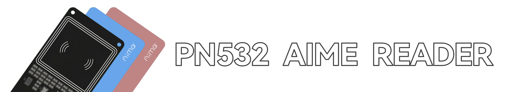


<h4 align="center">基于PN532+CH340的低成本SEGA系Aime读卡器</h>
<p align="center">
  
  
  
</p>

# ✨Feaure
 - 支持Felica协议的Aime卡读取,无需AimeDB读取真实**AccessCode**
 - 超低成本—PN532+CH340成本最低可至 **15 CNY** 
 - 支持SEGA全系游戏刷卡
 - 支持商用—MPL 2.0开源协议

# ⚡如何使用
 1. 确保你已安装segatools,并拥有一个PN532读卡器
 2. 确保你的设备已经安装了CH340驱动(除了ALLS的LTS 应该都会自动安装)
 3. 从 [Releases](https://github.com/zhicheng233/PN532-Aime-Reader/releases) 下载最新版本的`NfcAime.Dll.dll`，并将其放置在segatools的根目录
 4. 打开`segatools.ini`
     ```ini
     [aime]
     ; 确保[aime]中enable=1
     enable=1
     aimePath=DEVICE\aime.txt
     ```
     ```ini
     [aimeio]
     ; patch=dll的目录
     path=NfcAime.Dll.dll
     ; 读卡器串口号 默认为COM8 需与读卡器设置相同
     ReaderCOM=COM8
     ; 读卡器波特率 默认为115200 需与读卡器设置相同
     Baud=115200
     ; Felica协议的Aime卡读取模式 默认为1 
     ; 若设置为1，仅向游戏发送IDm，IDm->AccessCode的转换由服务器的AimeDB完成，否则直接读取Aime卡的AccessCode并发送给游戏
     ; 设置为1时读取的AccesCode是否正确由服务器的AimeDB实现是否正确决定
     IDmMode=1
     ```
 5. 保存 `segatools.ini` , 打开游戏, Enjoy

# 🚩常见问题
 - Q:游戏运行后读卡终端报错`A device attached to the system is not functioning.`
 - A:这种情况一般出现在ALLS等SEGA定制的LTS系统上,一般安装2016版的CH340驱动即可解决。[CH34x_Install_Windows_v3_4.zip](doc/CH34x_Install_Windows_v3_4.zip)
 - Q:设备管理器出现黄色感叹号，游戏无法连接读卡器
 - A:缺少CH340驱动，安装后重启电脑即可解决。[CH34x_Install_Windows_v3_4.zip](doc/CH34x_Install_Windows_v3_4.zip)

其他问题请提Issues

# ❤️ 鸣谢
 FeliCa读卡逻辑 源于 [ohdj/NfcAimeReader](https://github.com/ohdj/NfcAimeReader)

## 🤝 参与贡献

欢迎贡献代码！请随时提交 Pull Request。

1. Fork 本项目
2. 创建你的功能分支 (`git checkout -b feature/AmazingFeature`)
3. 提交你的更改 (`git commit -m '添加一些很棒的功能'`)
4. 推送到分支 (`git push origin feature/AmazingFeature`)
5. 打开一个 Pull Request


<a style="margin-top: 15px" href="https://github.com/zhicheng233/PN532-Aime-Reader/graphs/contributors">

</a>

# 📘 许可证 License
Love For Mozilla Public License Version 2.0 - MPL2.0 

# 🔓商用须知
本项目使用MPL 2.0开源协议，允许商用，但需要遵守以下条件：
 - 需要在产品文档中明确声明使用了本项目的代码，并提供本项目的链接
 - 需要在产品中包含本项目的许可证文件
 - 需要在产品中包含本项目的版权声明
 - 修改过的 MPL 文件必须公开源码